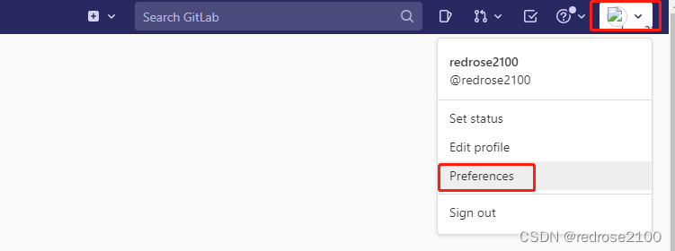
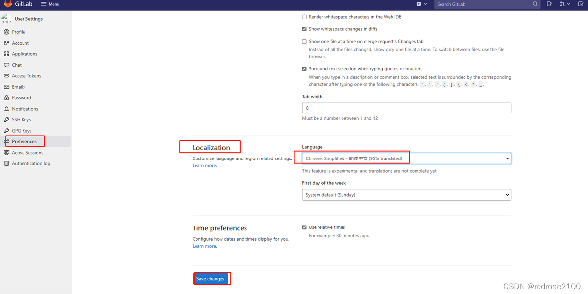

## GitLabe搭建

 <br/>

## 一、部署社区版gitlab

1、 安装gitlab的依赖项

```
yum install -y curl openssh-server openssh-clients postfix cronie policycoreutils-python
```

 // 10.x以后开始依赖policycoreutils-python

 <br/>

## 二、 启动postfix，并设置为开机启动 

```
systemctl start postfix
systemctl enable postfix
```

 <br/>

## 三、设置防火墙 

```
setenforce 0 
sed -i '7d' /etc/selinux/config
sed -i '7i SELINUX=disabled' /etc/selinux/config

systemctl stop firewalld

systemctl disable firewalld
```

 <br/>

## 四、获取gitlab的rpm包

国内链接：

wget https://mirrors.tuna.tsinghua.edu.cn/gitlab-ce/yum/el7/gitlab-ce-12.1.6-ce.0.el7.x86_64.rpm

或者官方连接：

官方下载：https://packages.gitlab.com/gitlab/gitlab-ce/

 <br/>

## 五、安装rpm包

```bash
[root@localhost ~]# rpm -ivh gitlab-ce-12.1.6-ce.0.el7.x86_64.rpm
```

根据提示，继续执行指令配置gitlab。

 <br/>

## 六、修改配置文件

将external_url变量的地址，修改自己需要的域名，或者是自己本机的 IP ，如 external_url 'http://172.25.55.54' ,最后执行：wq
```bash
[root@localhost ~]# vim /etc/gitlab/gitlab.rb
```

如果修改了配置文件，还需要重新加载配置内容。
```bash
[root@localhost ~]# gitlab-ctl reconfigure
[root@localhost ~]# gitlab-ctl restart
```

查看gitlab版本
```bash
[root@localhost ~]# head -1 /opt/gitlab/version-manifest.txt   
```
  

 <br/>


## 七、访问Gitlab

```
输入本机IP地址即可访问     默认账户root 密码需要自己定义

```

获取密码
```bah
Notes:
Default admin account has been configured with following details:
Username: root
Password: You didn't opt-in to print initial root password to STDOUT.
Password stored to /etc/gitlab/initial_root_password. This file will be cleaned up in first reconfigure run after 24 hours.

```


 如访问502 可以看下是不是 80 和 8080 端口被占用了，如果端口被占用，可以参考: [8080 端口被占用,访问 502](#jump)


<br/>  
  
## 修改语言为中文
点击头像，再点击【Preference】



找到【Localization】位置，选择简体中文，然后点击【Save changes】



再此刷新页面即可（其他用户也是一样操作）

<br/>

<br/>

<br/>

<br/>

## 常见问题：
### 问题一：<span id="jump">8080端口被占用，访问502</span>

 **解决方案:**
 
(1) 
```bash
vim /etc/gitlab/gitlab.rb
```
```bash
nginx['listen_port'] = 8000
```
(2) 
```bash
gitlab-ctl reconfigure
```

(3) 
```basj
vim /var/opt/gitlab/nginx/conf/gitlab-http.conf 
```bash
listen *:8000;
```
(4)然后重启gitlab服务
```bash
gitlab-ctl restart
```
注意:如果修改完gitlab-http.conf再运行gitlab-ctl reconfigure，就会被还原,修改并不会被覆盖。

(4)  查看端口占用情况
```bash
netstat -tunlp 
```
如下显示,则nigix 8000端口启动成功
```bash
tcp        0      0 0.0.0.0:8000            0.0.0.0:*               LISTEN      78769/nginx: master
```

### 问题二：卸载重装，一直卡在 ruby_block[wait for logrotate service socket] action run

\* file[/opt/gitlab/sv/logrotate/down] action nothing (skipped due to action :nothing)

\* directory[/opt/gitlab/service] action create (up to date)

\* link[/opt/gitlab/service/logrotate] action create (up to date)

\* ruby_block[wait for logrotate service socket] action run

解决方法：
```bash
1. 按住CTRL+C强制结束

2. 执行  systemctl restart gitlab-runsvdir

3. 再次执行  gitlab-ctl reconfigure
```

