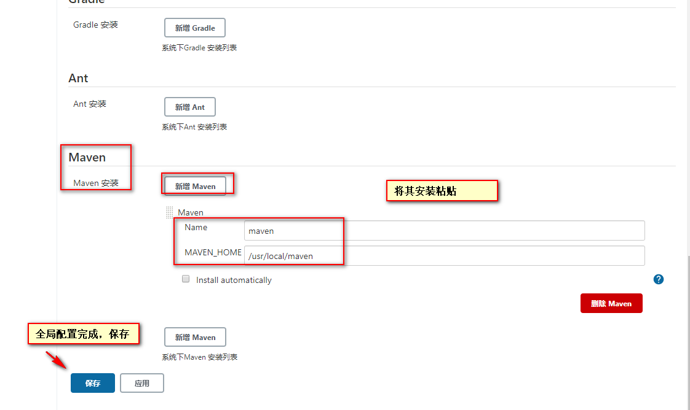

## 关闭防火墙

```bash
systemctl stop firewalld.service
systemctl disable firewalld.service
```
```bash
# 通过命令临时禁用 SELinux
setenforce 0

# 修改配置文件
sed -i 's/^SELINUX=enforcing/SELINUX=disabled/g' /etc/selinux/config
```

## 安装依赖软件 JDK
  ```bash
 yum install java-11-openjdk* -y
  ```
  使用 war 包安装 Jenkins（自行去官网下载 [https://www.jenkins.io/download/](https://www.jenkins.io/download/))
  
  ```bash
[root@localhost local]# mkdir jenkins    #创建jenkins目录
[root@localhost local]# cd jenkins/  #进入安装目录
[root@localhost jenkins]# rz  #上传安装包
jenkins.war
  ```
## 启动 jenkins
 ```bash
 [root@localhost jenkins]# java -jar jenkins.war     #执行java -jar jenkins.war 即可前台启动
 ```
  有以下输出，表示启动成功
 
 
 
 
 ## 解锁jenkins
 
 

## 安装配置(选择自定义配置)


    如果在安装插件的途中觉得安装忒慢，可以尝试更换他的镜像源，因为Jenkins默认使用的是国外镜像源所以会有些慢，这里我们可以更改为清华镜像源
    ```bash
    [root@Cengtos7-4 .jenkins]# sed -i 's/http:\/\/www.google.com\//http:\/\/www.baidu.com\//g' /root/.jenkins/updates/default.json
    [root@Cengtos7-4 .jenkins]# sed -i 's#http://updates.jenkins-ci.org/download/#https://mirrors.tuna.tsinghua.edu.cn/jenkins/#g' /root/.jenkins/updates/default.json
    ```
  创建用户后，默认下一步  
    
 ## 全局设置
 
 
 
 
 
 
 
 
  下载 maven [https://maven.apache.org/download.cgi](https://maven.apache.org/download.cgi)
  
 
 
 
 
 
 
 
 
 
 ## 设置开机启动Jenkins
 
到/usr/local/jenkins/目录下创建 启动/停止 脚本

```bash
cd /usr/local/jenkins/shell

```

```bash
cat << EOF >startup.sh
#!/bin/sh
java -jar /usr/local/jenkins/jenkins.war --httpPort=8080
EOF
```


``` bash
cat << EOF >shutdown.sh
#/bin/sh
# 使用fuser关闭占用端口的程序
fuser -k 8080/tcp
EOF
```


添加可执行权限

 ```bash
 chmod +x startup.sh shutdown.sh
 ```

 在 /lib/systemd/system 服务注册目录下创建 jenkins.service

 ```bash
 vim /lib/systemd/system/jenkins.service
 ```

 ```bash
[Unit]
Description=jenkins project
After=network.target

[Service]
Type=simple

ExecStart=/usr/local/jenkins/startup.sh
ExecReload=
ExecStop=/usr/local/jenkins/shutdown.sh
PrivateTmp=true
 ```

 刷新配置

 ```bash
 systemctl daemon-reload
 ```

启动 jenkins

```bash
systemctl start jenkins.service
```


查看 jenkins 状态

``` bash
systemctl status jenkins.service
```


停止 jenkins 

``` bash
systemctl stop jenkins.service
```


查看 jenkins 状态

``` bash
systemctl status jenkins.service
```


设置开机启动

 ```bash
 systemctl enable jenkins.service
 ```

 

查看设置开机启动的服务列表

 ```bash
 systemctl list-units --type=service |grep jenkins
 ```


 # 
## 到此 jenkins 部署完成


