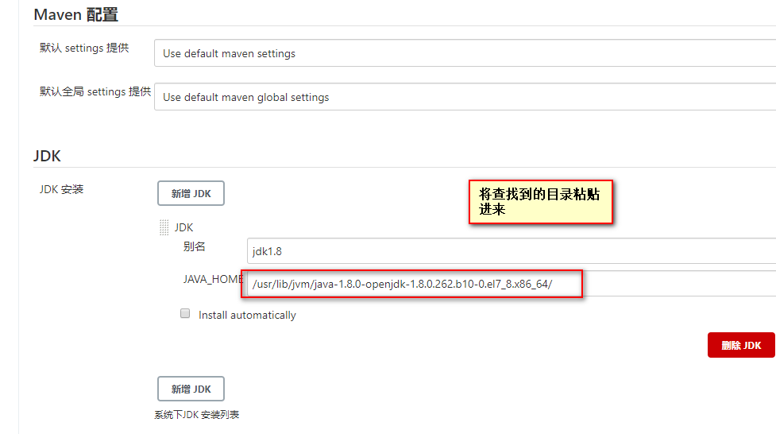

## 安装依赖软件 JDK
  ```bash
  yum install java-1.8.0-openjdk* -y
  ```
  使用 war 包安装 Jenkins（自行去官网下载 [https://www.jenkins.io/download/](https://www.jenkins.io/download/)
  
  ```bash
[root@localhost local]# mkdir jenkins    #创建jenkins目录
[root@localhost local]# cd jenkins/  #进入安装目录
[root@localhost jenkins]# rz  #上传安装包
jenkins.war
  ```
## 启动 jenkins
 ```bash
 [root@localhost jenkins]# java -jar jenkins.war     #执行java -jar jenkins.war 即可前台启动
 ```
  有以下输出，表示启动成功
 
 
 
 
 ## 解锁jenkins
 
 

## 安装配置(选择自定义配置)


    如果在安装插件的途中觉得安装忒慢，可以尝试更换他的镜像源，因为Jenkins默认使用的是国外镜像源所以会有些慢，这里我们可以更改为清华镜像源
    ```bash
    [root@Cengtos7-4 .jenkins]# sed -i 's/http:\/\/www.google.com\//http:\/\/www.baidu.com\//g' /root/.jenkins/updates/default.json
    [root@Cengtos7-4 .jenkins]# sed -i 's#http://updates.jenkins-ci.org/download/#https://mirrors.tuna.tsinghua.edu.cn/jenkins/#g' /root/.jenkins/updates/default.json
    ```
  创建用户后，默认下一步  
    
 ## 全局设置
 
 
 
 
 
 
 
 
  下载 maven [https://maven.apache.org/download.cgi](https://maven.apache.org/download.cgi)
  
 
 
 
 
 
 
 
 
 
 ## 设置开机启动Jenkins
 
 到/home/jenkins/shell目录下创建启动脚本jenkins.sh

```bash
mkdir -p /usr/local/jenkins/shell
cd /usr/local/jenkins/shell
vim jenkins.sh
```

```bash
#!/usr/bin/bash

# 导入环境变量
export JENKINS_HOME=/usr/local/jenkins/

cd $JENKINS_HOME

pid=`ps -ef | grep jenkins.war | grep -v 'grep'| awk '{print $2}'`
if [ "$1" = "start" ];then
if [ -n "$pid" ];then
    echo 'jenkins is running...'
else
    # java启动服务 配置java安装根路径,和启动war包存的根路径
    nohup java -DJENKINS_HOME=$JENKINS_HOME/root -jar $JENKINS_HOME/jenkins.war --httpPort=8080 >/dev/null 2>&1 &
    echo "服务启动查看进程:"
    echo `ps -ef | grep jenkins.war | grep -v 'jenkins.sh'|grep -v grep`
fi
elif [ "$1" = "stop" ];then
    exec ps -ef | grep jenkins | grep -v grep | awk '{print $2}'| xargs kill -9
    echo 'jenkins is stop...'
else
    echo 'Please input like this:"./jenkins.sh start" or "./jenkins stop"'
fi
```
 
 添加可执行权限
 
 ```bash
 chmod +x /usr/local/jenkins/shell/jenkins.sh
 ```
 
 在 /lib/systemd/system 服务注册目录下创建 jenkins.service
 
 ```bash
 vim /lib/systemd/system/jenkins.service
 ```
 
 ```bash
 [Unit]
Description=Jenkins
After=network.target

[Service]
Type=forking
User=jenkins
Group=jenkins
ExecStart=/usr/local/jenkins/shell/jenkins.sh start
ExecReload=/usr/local/jenkins/shell/jenkins.sh reload
ExecStop=/usr/local/jenkins/shell/jenkins.sh stop
PrivateTmp=true

[Install]
WantedBy=multi-user.target
 ```
 
 刷新配置
 
 ```bash
 systemctl daemon-reload
 ```
 
 设置开机启动
 ```bash
 systemctl enable jenkins.service
 ```
 查看设置开机启动的服务列表
 ```bash
 systemctl list-units --type=service
 ```
 
 # 
## 到此 jenkins 部署完成


